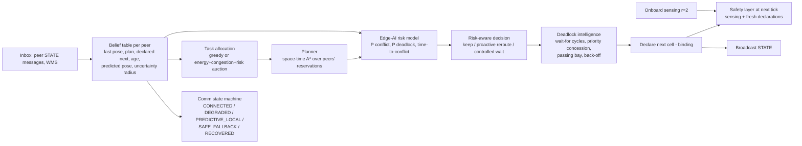

# Architecture: EdgeSwarm decentralized fleet coordination

This repository now contains **two simulators side by side**:

| | Legacy simulator (preserved) | EdgeSwarm engine (new) |
|---|---|---|
| Code | `src/simulation/`, `src/coordination/`, `src/planning/` | `src/swarm/`, `src/edge_ai/`, `src/command_center/` |
| Decision model | one process reads every robot's true state, robots updated one after another | every robot decides **simultaneously** from its **own** inbox, sensors and odometry |
| Communication | message log, no range/latency/loss applied | radio model with range, latency + jitter, loss, dead zones, outages, per-link failures, bytes |
| Planning | static A*, current-tick reservation | stop-and-wait / reactive A* / **space-time A*** with reservations from peers' broadcast plans |
| UI | classic dashboard (removed) | Fleet Command Center `/command-center` (`/` redirects here) |
| CLI | `--mode demo | dashboard | benchmark | simulation` (unchanged) | `--mode swarm | edge-demo | swarm-benchmark | ablation | train-ai | deadlock-suite | edge-profile` |

All 109 original tests still pass. The legacy code was only changed to remove the hard-coded benchmark figures
(see `docs/LIMITATIONS.md`).

## 1. Tick loop (`src/swarm/engine.py`)

One tick is 1 s of robot time and one cell is 1 m, so robots move at 1 m/s.

```mermaid
sequenceDiagram
    participant N as Radio network
    participant R as Each robot (edge computer)
    participant W as World (physics, ground truth)
    N->>R: 1. deliver messages due this tick (range/latency/loss/dead zones applied)
    R->>R: 2. act(): execute the move declared last tick through the safety layer
    R->>W: intended move
    W->>W: 3. apply all moves simultaneously; ground-truth collision / near-collision / deadlock monitor
    W->>W: 4. humans walk, blockages appear/clear, WMS events
    W->>R: odometry + onboard sensing (radius 2)
    R->>R: 5. think(): comm state, tasks, allocation, planning, Edge-AI, deadlock handling, declare next move
    R->>N: broadcast STATE (pose, plan, declared next cell, priority, claim, waiting-for, blockages)
```

The engine never plans for a robot. Step 5 runs the same `RobotAgent.think()` independently for each robot, using
only that robot's knowledge. The World is the "real world": robots never read it except through sensing within 2
cells and their own odometry.

## 2. Robot agent (`src/swarm/agent.py`)



### 2.1 Safety layer: why collisions are impossible even when the network fails

A robot X may enter cell `c` at tick `t` only if both hold:

1. `c` is walkable, and no robot, person or blockage is **sensed** in `c` at the start of `t`.
2. For every sensed robot Y adjacent to `c` that outranks X under the static position rank (row-major order of the
   two robots' current cells), X holds Y's **binding** declaration from the end of `t-1`, and that declaration is
   not `c`. X associates Y only by an exact position match on a fresh report.

Declarations are binding: a robot only ever moves to the cell it announced (or stays put).

Proof sketch:
- Suppose two robots X and Y both enter `c`. Both were adjacent to `c`, so they were within sensing radius 2 of each
  other. Without loss of generality Y outranks X.
- X moved, so X held a fresh declaration from Y naming another cell.
- But Y moved into `c`, so Y had declared `c`. Contradiction.
- Swaps and tail-gating are impossible because `c` must be empty at the start of the tick.

The rule uses only sensing and the binding declaration. With loss, latency, dead zones or outages, a robot simply
lacks fresh declarations and becomes more conservative. It never becomes unsafe.

The ground-truth monitor in `World.apply_moves` checks every tick of every run independently. A randomized property
test runs with 40% loss, up to 1.8 s latency and a dead zone
(`tests/test_swarm_core.py::test_zero_collisions_under_heavy_packet_loss_and_latency`).

### 2.2 Coordination modes (ablation ladder)

| Mode | Allocation | Planning | Conflict / deadlock | Comms use |
|---|---|---|---|---|
| A `stop_and_wait` | nearest pickup | own shortest path, ignores others | wait; randomized timeout re-plan / back-off | declarations for the safety layer only |
| B `decentralized_astar` | nearest pickup | static A* re-planned around peers' current and next cells | reactive re-plan, livelock breaker | peer poses and next cells |
| C `reservation` | nearest pickup | space-time A* around higher-priority peers' broadcast plans | priority negotiation, wait-for cycle detection + yield, priority concession, queueing, passing bays | full plans (12 cells), priorities, waiting-for |
| D `reservation_ai` | as C | as C | + Edge-AI proactive reroute / controlled wait | as C |
| E `full` | energy + congestion + conflict-risk auction with explanations | as C, + uncertainty-inflated beliefs | as D, + resilient comm states, blockage gossip, wait-vs-detour | + blockage gossip, recovery resync |

All modes share the same safety layer, task set, physics and battery model. The comparison therefore isolates the
coordination strategy.

## 3. Communication model (`src/swarm/network.py`)

- Broadcast within `range_cells` (Euclidean, default 8 m).
- Delivery at `send_tick + 1 + floor(latency / 1000 ms)`, where latency is uniform in mean ± jitter.
- Independent loss per receiver.
- Dead-zone rectangles and global outage windows (with time bounds), plus per-robot radio failures and per-link
  failures.
- Message size is the compact JSON length. The engine reports bytes and overhead per robot per tick.
- The WMS (order source) reaches robots whose radio is up, and re-broadcasts events for 50 ticks. It is an order
  source only, not a coordinator.

## 4. Edge-AI (`src/edge_ai/`)

`features.py` → `dataset.py` → `train.py` → `model.py` (numpy-only runtime). See `docs/EDGE_AI.md`.

## 5. Command Center (`src/command_center/`, `src/visualization/command_center.html`)

`SwarmController` owns one simulation and a background tick thread. The existing HTTP server exposes:

| Route | Purpose |
|---|---|
| `GET /command-center` | page |
| `GET /api/swarm/state` | full snapshot: robots, paths, risks, comm states, explanations, events, metrics |
| `GET /api/swarm/catalog` | modes, presets, scenarios, saved custom scenarios, edge profiles |
| `GET /api/swarm/benchmark` | measured summaries from `experiments/results/*_summary.json` and `models/training_report.json` |
| `POST /api/swarm/command` | start / pause / step / reset / speed / configure / build_scenario / load_custom / event / demo |

The controller only steps the simulation and injects operator disruptions. It never makes a robot's decision.

## 6. Simulation vs edge mode (`SwarmConfig.edge`, `experiments/performance.py`, `deploy/`)

| Aspect | Simulation mode | Edge mode (profile `raspberry_pi_4` / `jetson_nano`) |
|---|---|---|
| Robot decision code | identical | identical |
| Compute time | measured on the host | host time × **assumed** slowdown (6× Pi 4, 4× Jetson Nano) |
| Budget | none | 200 ms per robot per tick. Over budget, the robot holds position that tick (counted as `budget_overruns`). |
| RAM | Python peak via tracemalloc | reported against the profile budget |
| Messages | JSON bytes counted | same, checked against a 1,400-byte datagram budget |

**Nothing has been run on physical hardware.** `deploy/edge/edge_benchmark.py` measures the per-robot decision loop on a
real Pi or Jetson, and `deploy/docker/Dockerfile.edge` builds an arm64 image. See `docs/LIMITATIONS.md`.
